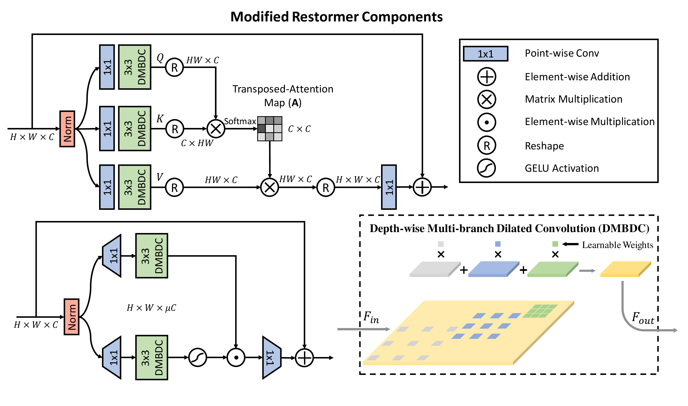

# MegCup 2022 Team Feedback

This repository is the **1st** place solution (Team Feedback) in [2022 MegCup RAW image denoising](https://studio.brainpp.com/competition/5?tab=rank).

## Members 
- [Ling-Hao Han](https://github.com/hlh981029)
- [Zuo-Liang Zhu](https://github.com/NK-CS-ZZL)
- [Weilei Wen](https://github.com/wwlCape)

## Overview

<div align="center">
    
</div>

## Environment

```bash
git clone https://github.com/hlh981029/megcup-feedback.git
cd megcup-feedback

conda env create -f environment.yaml
conda activate feedback
```

## Dataset

Please download the [dataset](https://studio.brainpp.com/competition/5?tab=questions) to `./data`,
and refer to `options/feedback.yaml` to modify the data path.

```bash
|--data
   |--competition_train_input.0.2.bin
   |--competition_train_gt.0.2.bin
   |--competition_test_input.0.2.bin
```

## Evaluation

```bash
# evaluate on dataset
# log and config file will be saved to ./output/feedback

python test.py

# generate result bin file
# result will be saved to ./output/feedback/submit/model_best_result.bin

python test.py --submit
```


## Acknowledgement

This project is based on [Global2Local](https://github.com/ShangHua-Gao/G2L-search), [Swin-Transformer](https://github.com/microsoft/Swin-Transformer), [Restormer](https://github.com/swz30/Restormer), and [BasicSR](https://github.com/xinntao/BasicSR).

